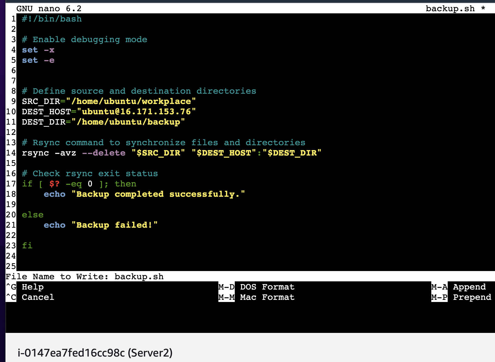
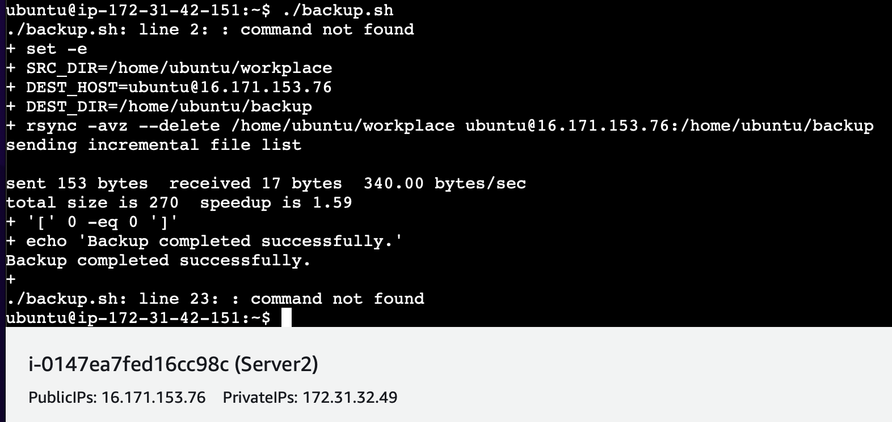
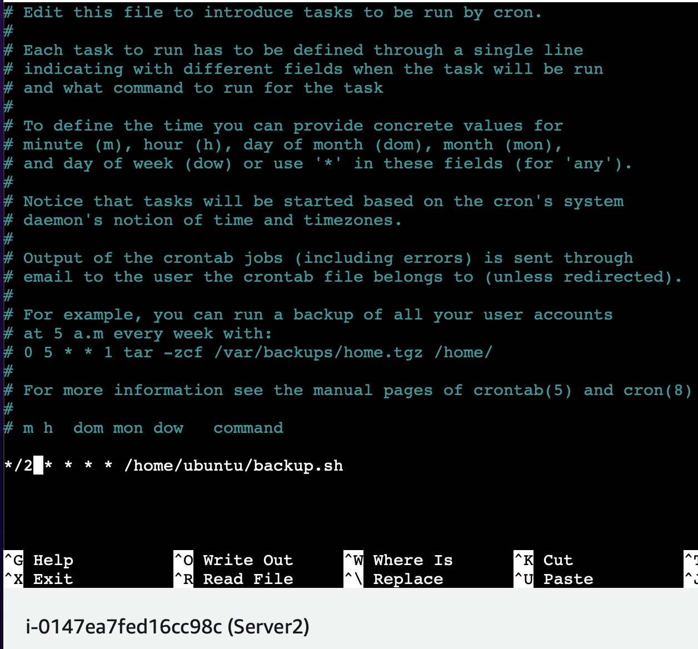

# Linux Project - Automated Backup via SSH connection betwenn servers using Rsync and Crontab

## Prerequisites
Below are prerequisites needed for the project:

- Two Ubuntu servers (Server1 and Server2)
- SSH access to both servers
- Basic knowledge of Linux command line
​

## Step by Step Implementation

The following step by step guide is used to implement the project

### Step 1 : Setup Server1 and Server2 on AWS

​Setup the ubuntu servers on AWS. Ensure SSH traffic is enabled on both servers.


Update the servers and install Rsync.
​
```
sudo apt update
```

```​
sudo apt install rsync
```
​

### Step 2 : Configure SSH Key-based Authentication

We will set up SSH key-based authentication between the 2 servers to allow secure communication without password prompts.
​

Generate an SSH key pair on server2:
​
```
ssh-keygen -t rsa
```

​

​Run the command below on server2 and copy the displayed text
​
```
cat ~/.ssh/id_rsa.pub
```
​
Run the command below in server1
​
```
echo "your_copied_public_key_here" >> ~/.ssh/authorized_keys
```
​

Change permission of authorized_keys in server1
​
```
chmod 700 ~/.ssh/authorized_keys
```
Once the public key from server2 has been copied into the server1, try connecting to the server1 using SSH from the server2:
​
```
ssh username@target_server_ip_address
```


​Run `exit` to close the connection

Once all the above is complete, carry out the same above steps to allow server1 to ssh to server2:

​

​

### Step 3 : Create test users and user data to backup

On server2, create a directory named backup then SSH connect from server2 into server1 and create test directory (workplace) inside server1

`mkdir workplace`

Add test files using touch command and configuration data using nano editor


Check on server1 directly if test directory and files created via ssh connection of server2 to server are present 


### Step 4 : Create Backup Script

While still connected via ssh from server2 to server1, create a backup script in server1, then open it with nano editor

```
touch backup.sh
```

```
nano backup.sh
```
​
Copy the below into the backup.sh and modify as required
​
```
#!/bin/bash
​
set -x
set -e
​
​
# Define source and destination directories
SRC_DIR="/path/to/source"
DEST_HOST="username@destination_server_ip"
DEST_DIR="/path/to/destination"
​
# Rsync command to synchronize files and directories
rsync -avz --delete $SRC_DIR $DEST_HOST:$DEST_DIR
​
# Check rsync exit status
if [ $? -eq 0 ]; then
    echo "Backup completed successfully."
    
else
    echo "Backup failed!"
   
fi
​
```

Save the edited script and exit. 


​

Make the script executable:
​
```
chmod +x backup.sh
```
​Check backup to server2 from server1 works by running

`./backup.sh`

Backup to server2 can also be carried out using the rsync command
```
rsync -a ~/source_directory username@remote_host:destination_directory
```



If successful, seerver2 backup directory will now contain the test directory and file data from the server1


### Step 5 : Schedule Backup with Cron
Create a new test file in the test directory "workplace" in server1 and edit as required with nano. 


Edit the crontab file to schedule the backups. Do this via server2 ssh connection to server1:
​
```
crontab -e
```
Add a cron job to execute the backup script 2 minute intervals
​
```
*/2 * * * * /path/to/backup.sh
```


Check status of backup after 2 mins in server2 backup directory

